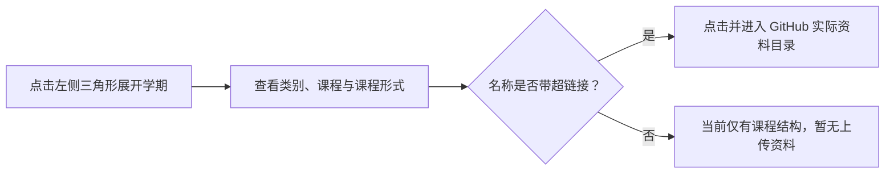

<div align="center">

<a id="top"></a>

# [深圳北理莫斯科大学（МГУ-ППИ）· ВМК · ПМИ 本科课程资料库](https://github.com/Bluevarpi/smbu-vmk-math/)

**数学与计算 · 按学期索引 · 本科课程学习资料**

面向课程检索、复习、知识梳理与学习交流的非官方资料整理仓库。

<p>
  <a href="#课程目录"></a>
  <a href="#资料概况"></a>
  <a href="#github"></a>
</p>

<p>
  
  
  
  
</p>

</div>

| 项目 | 信息 |
| --- | --- |
| 学校 | 深圳北理莫斯科大学（МГУ-ППИ） |
| 院系 | 计算数学与控制系（Факультет вычислительной математики и кибернетики，简称 ВМК） |
| 专业 | 应用数学与信息学（Прикладная математика и информатика，简称 ПМИ） |
| 国内对应专业 | 数学与应用数学 |
| 资料性质 | 非学校、院系或课程官方发布渠道；由仓库维护者与数学学社成员在课程学习过程中持续整理与汇编 |

## 导航

[项目简介](#项目简介) · [资料概况](#资料概况) · [课程目录](#课程目录) · [使用方法](#使用方法) · [资料说明](#资料说明) · [目录规范](#目录规范) · [GitHub 模块](#github) · [贡献](#贡献)

## 项目简介

本仓库整理深圳北理莫斯科大学（МГУ-ППИ）计算数学与控制系（ВМК）应用数学与信息学（ПМИ）本科阶段的课程学习资料。内容主要来源于仓库维护者与数学社成员在课程学习过程中形成的个人课堂笔记、学习整理稿、习题记录及相关学习材料，用于课程检索、复习、知识梳理与学习交流。

本仓库不代表学校、院系、任课教师或课程的官方立场，也不承诺资料的完整性、时效性或与当学期教学安排完全一致；具体课程要求应以学校和任课教师发布的信息为准。

## 资料概况

<table>
  <tr>
    <th align="center">学期范围</th>
    <th align="center">当前课程资料</th>
    <th align="center">C 源文件</th>
  </tr>
  <tr>
    <td align="center"><strong>01—07 学期</strong></td>
    <td align="center"><strong>723 个文件</strong></td>
    <td align="center"><strong>218 个 .c</strong></td>
  </tr>
</table>

### 资料格式分布

以课程资料文件数为统计口径（不含仓库根目录的 `README.md` 与 `.gitignore`）。下列彩色双段式徽章同时显示**文件数与占比**。

<div align="center">

<p>
  
  
  
  
</p>

</div>

### 源代码语言占比

以当前仓库中可直接识别的源码文件扩展名 `.c`、`.py`、`.tex` 为口径，**按源文件数量**计算比例；图片、PDF 与 TXT 不计入源码语言分母。

<div align="center">

<p>
  
  
  
</p>

</div>

> [!NOTE]
> 以上**文件数量与语言占比徽章**是 **2026-10-09 资料快照**，按实际文件扩展名计数，并非 GitHub Linguist 自动识别结果；新增文件后应同步更新。Python 与 LaTeX 的 0% 仅表示目前没有对应扩展名的源文件，不代表相关课程不存在。下方 GitHub 活动徽章则由 Shields.io 动态获取状态。

## 课程目录

课程结构按“学期 → 类别 → 课程 → 课程形式”完整列出；**有链接表示当前有真实资料，无链接表示目前尚无已上传资料**。

> [!TIP]
> **查看完整课程分支：**在下方各学期标题的**左侧点击小三角形（▶）**，即可展开或收起该学期的“类别 → 课程 → 课程形式”细目；也可点击不带链接的学期标题进行展开。**有超链接的名称**可直接打开 GitHub 上已经有实际文件的对应文件夹；**无链接的名称**表示该分支目前尚无已上传文件。若学期标题本身带链接，请点击左侧三角形来展开，点击标题文字则进入资料目录。


<details>
<summary><strong>01-第一学期（大一上）</strong></summary>

- **语言**
  - 专业俄语
  - 基础俄语

</details>

<details>
<summary><strong><a href="https://github.com/Bluevarpi/smbu-vmk-math/tree/main/02-%E7%AC%AC%E4%BA%8C%E5%AD%A6%E6%9C%9F%EF%BC%88%E5%A4%A7%E4%B8%80%E4%B8%8B%EF%BC%89">02-第二学期（大一下）</a></strong></summary>

- **数学**
  - 数学专业导论
    - Seminar（小课）
  - 系主任导论
    - Lecture（大课）
- **[信息](https://github.com/Bluevarpi/smbu-vmk-math/tree/main/02-%E7%AC%AC%E4%BA%8C%E5%AD%A6%E6%9C%9F%EF%BC%88%E5%A4%A7%E4%B8%80%E4%B8%8B%EF%BC%89/%E4%BF%A1%E6%81%AF)**
  - [信息实践](https://github.com/Bluevarpi/smbu-vmk-math/tree/main/02-%E7%AC%AC%E4%BA%8C%E5%AD%A6%E6%9C%9F%EF%BC%88%E5%A4%A7%E4%B8%80%E4%B8%8B%EF%BC%89/%E4%BF%A1%E6%81%AF/%E4%BF%A1%E6%81%AF%E5%AE%9E%E8%B7%B5)
    - [Practice（实践课）](https://github.com/Bluevarpi/smbu-vmk-math/tree/main/02-%E7%AC%AC%E4%BA%8C%E5%AD%A6%E6%9C%9F%EF%BC%88%E5%A4%A7%E4%B8%80%E4%B8%8B%EF%BC%89/%E4%BF%A1%E6%81%AF/%E4%BF%A1%E6%81%AF%E5%AE%9E%E8%B7%B5/Practice%EF%BC%88%E5%AE%9E%E8%B7%B5%E8%AF%BE%EF%BC%89)

</details>

<details>
<summary><strong>03-第三学期（大二上）</strong></summary>

- **数学**
  - 代数与几何-I
    - Lecture（大课）
    - Seminar（小课）
  - 数学分析-I
    - Lecture（大课）
    - Seminar（小课）
- **信息**
  - 算法导论
    - Lecture（大课）
  - 计算机实践-I
    - Practice（实践课）

</details>

<details>
<summary><strong><a href="https://github.com/Bluevarpi/smbu-vmk-math/tree/main/04-%E7%AC%AC%E5%9B%9B%E5%AD%A6%E6%9C%9F%EF%BC%88%E5%A4%A7%E4%BA%8C%E4%B8%8B%EF%BC%89">04-第四学期（大二下）</a></strong></summary>

- **[数学](https://github.com/Bluevarpi/smbu-vmk-math/tree/main/04-%E7%AC%AC%E5%9B%9B%E5%AD%A6%E6%9C%9F%EF%BC%88%E5%A4%A7%E4%BA%8C%E4%B8%8B%EF%BC%89/%E6%95%B0%E5%AD%A6)**
  - [代数与几何-II](https://github.com/Bluevarpi/smbu-vmk-math/tree/main/04-%E7%AC%AC%E5%9B%9B%E5%AD%A6%E6%9C%9F%EF%BC%88%E5%A4%A7%E4%BA%8C%E4%B8%8B%EF%BC%89/%E6%95%B0%E5%AD%A6/%E4%BB%A3%E6%95%B0%E4%B8%8E%E5%87%A0%E4%BD%95-II)
    - [Lecture（大课）](https://github.com/Bluevarpi/smbu-vmk-math/tree/main/04-%E7%AC%AC%E5%9B%9B%E5%AD%A6%E6%9C%9F%EF%BC%88%E5%A4%A7%E4%BA%8C%E4%B8%8B%EF%BC%89/%E6%95%B0%E5%AD%A6/%E4%BB%A3%E6%95%B0%E4%B8%8E%E5%87%A0%E4%BD%95-II/Lecture%EF%BC%88%E5%A4%A7%E8%AF%BE%EF%BC%89)
    - Seminar（小课）
  - [数学分析-II](https://github.com/Bluevarpi/smbu-vmk-math/tree/main/04-%E7%AC%AC%E5%9B%9B%E5%AD%A6%E6%9C%9F%EF%BC%88%E5%A4%A7%E4%BA%8C%E4%B8%8B%EF%BC%89/%E6%95%B0%E5%AD%A6/%E6%95%B0%E5%AD%A6%E5%88%86%E6%9E%90-II)
    - [Lecture（大课）](https://github.com/Bluevarpi/smbu-vmk-math/tree/main/04-%E7%AC%AC%E5%9B%9B%E5%AD%A6%E6%9C%9F%EF%BC%88%E5%A4%A7%E4%BA%8C%E4%B8%8B%EF%BC%89/%E6%95%B0%E5%AD%A6/%E6%95%B0%E5%AD%A6%E5%88%86%E6%9E%90-II/Lecture%EF%BC%88%E5%A4%A7%E8%AF%BE%EF%BC%89)
    - Seminar（小课）
  - 离散数学
    - Lecture（大课）
    - Seminar（小课）
- **信息**
  - 算法与数据结构
    - Lecture（大课）
  - 计算机实践-II
    - Practice（实践课）

</details>

<details>
<summary><strong><a href="https://github.com/Bluevarpi/smbu-vmk-math/tree/main/05-%E7%AC%AC%E4%BA%94%E5%AD%A6%E6%9C%9F%EF%BC%88%E5%A4%A7%E4%B8%89%E4%B8%8A%EF%BC%89">05-第五学期（大三上）</a></strong></summary>

- **[数学](https://github.com/Bluevarpi/smbu-vmk-math/tree/main/05-%E7%AC%AC%E4%BA%94%E5%AD%A6%E6%9C%9F%EF%BC%88%E5%A4%A7%E4%B8%89%E4%B8%8A%EF%BC%89/%E6%95%B0%E5%AD%A6)**
  - [常微分方程](https://github.com/Bluevarpi/smbu-vmk-math/tree/main/05-%E7%AC%AC%E4%BA%94%E5%AD%A6%E6%9C%9F%EF%BC%88%E5%A4%A7%E4%B8%89%E4%B8%8A%EF%BC%89/%E6%95%B0%E5%AD%A6/%E5%B8%B8%E5%BE%AE%E5%88%86%E6%96%B9%E7%A8%8B)
    - [Lecture（大课）](https://github.com/Bluevarpi/smbu-vmk-math/tree/main/05-%E7%AC%AC%E4%BA%94%E5%AD%A6%E6%9C%9F%EF%BC%88%E5%A4%A7%E4%B8%89%E4%B8%8A%EF%BC%89/%E6%95%B0%E5%AD%A6/%E5%B8%B8%E5%BE%AE%E5%88%86%E6%96%B9%E7%A8%8B/Lecture%EF%BC%88%E5%A4%A7%E8%AF%BE%EF%BC%89)
    - Seminar（小课）
  - [数值方法](https://github.com/Bluevarpi/smbu-vmk-math/tree/main/05-%E7%AC%AC%E4%BA%94%E5%AD%A6%E6%9C%9F%EF%BC%88%E5%A4%A7%E4%B8%89%E4%B8%8A%EF%BC%89/%E6%95%B0%E5%AD%A6/%E6%95%B0%E5%80%BC%E6%96%B9%E6%B3%95)
    - [Lecture（大课）](https://github.com/Bluevarpi/smbu-vmk-math/tree/main/05-%E7%AC%AC%E4%BA%94%E5%AD%A6%E6%9C%9F%EF%BC%88%E5%A4%A7%E4%B8%89%E4%B8%8A%EF%BC%89/%E6%95%B0%E5%AD%A6/%E6%95%B0%E5%80%BC%E6%96%B9%E6%B3%95/Lecture%EF%BC%88%E5%A4%A7%E8%AF%BE%EF%BC%89)
    - Seminar（小课）
  - [级数理论与多重积分](https://github.com/Bluevarpi/smbu-vmk-math/tree/main/05-%E7%AC%AC%E4%BA%94%E5%AD%A6%E6%9C%9F%EF%BC%88%E5%A4%A7%E4%B8%89%E4%B8%8A%EF%BC%89/%E6%95%B0%E5%AD%A6/%E7%BA%A7%E6%95%B0%E7%90%86%E8%AE%BA%E4%B8%8E%E5%A4%9A%E9%87%8D%E7%A7%AF%E5%88%86)
    - [Lecture（大课）](https://github.com/Bluevarpi/smbu-vmk-math/tree/main/05-%E7%AC%AC%E4%BA%94%E5%AD%A6%E6%9C%9F%EF%BC%88%E5%A4%A7%E4%B8%89%E4%B8%8A%EF%BC%89/%E6%95%B0%E5%AD%A6/%E7%BA%A7%E6%95%B0%E7%90%86%E8%AE%BA%E4%B8%8E%E5%A4%9A%E9%87%8D%E7%A7%AF%E5%88%86/Lecture%EF%BC%88%E5%A4%A7%E8%AF%BE%EF%BC%89)
    - Seminar（小课）
  - [线性代数计算方法](https://github.com/Bluevarpi/smbu-vmk-math/tree/main/05-%E7%AC%AC%E4%BA%94%E5%AD%A6%E6%9C%9F%EF%BC%88%E5%A4%A7%E4%B8%89%E4%B8%8A%EF%BC%89/%E6%95%B0%E5%AD%A6/%E7%BA%BF%E6%80%A7%E4%BB%A3%E6%95%B0%E8%AE%A1%E7%AE%97%E6%96%B9%E6%B3%95)
    - [Lecture（大课）](https://github.com/Bluevarpi/smbu-vmk-math/tree/main/05-%E7%AC%AC%E4%BA%94%E5%AD%A6%E6%9C%9F%EF%BC%88%E5%A4%A7%E4%B8%89%E4%B8%8A%EF%BC%89/%E6%95%B0%E5%AD%A6/%E7%BA%BF%E6%80%A7%E4%BB%A3%E6%95%B0%E8%AE%A1%E7%AE%97%E6%96%B9%E6%B3%95/Lecture%EF%BC%88%E5%A4%A7%E8%AF%BE%EF%BC%89)
- **[信息](https://github.com/Bluevarpi/smbu-vmk-math/tree/main/05-%E7%AC%AC%E4%BA%94%E5%AD%A6%E6%9C%9F%EF%BC%88%E5%A4%A7%E4%B8%89%E4%B8%8A%EF%BC%89/%E4%BF%A1%E6%81%AF)**
  - [函数式编程（旧）](https://github.com/Bluevarpi/smbu-vmk-math/tree/main/05-%E7%AC%AC%E4%BA%94%E5%AD%A6%E6%9C%9F%EF%BC%88%E5%A4%A7%E4%B8%89%E4%B8%8A%EF%BC%89/%E4%BF%A1%E6%81%AF/%E5%87%BD%E6%95%B0%E5%BC%8F%E7%BC%96%E7%A8%8B%EF%BC%88%E6%97%A7%EF%BC%89)
    - [Lecture（大课）](https://github.com/Bluevarpi/smbu-vmk-math/tree/main/05-%E7%AC%AC%E4%BA%94%E5%AD%A6%E6%9C%9F%EF%BC%88%E5%A4%A7%E4%B8%89%E4%B8%8A%EF%BC%89/%E4%BF%A1%E6%81%AF/%E5%87%BD%E6%95%B0%E5%BC%8F%E7%BC%96%E7%A8%8B%EF%BC%88%E6%97%A7%EF%BC%89/Lecture%EF%BC%88%E5%A4%A7%E8%AF%BE%EF%BC%89)
  - 操作系统
    - Lecture（大课）
  - 数据库
    - Lecture（大课）
    - Seminar（小课）
  - 数据挖掘（新）
    - Lecture（大课）
  - [计算机实践-III](https://github.com/Bluevarpi/smbu-vmk-math/tree/main/05-%E7%AC%AC%E4%BA%94%E5%AD%A6%E6%9C%9F%EF%BC%88%E5%A4%A7%E4%B8%89%E4%B8%8A%EF%BC%89/%E4%BF%A1%E6%81%AF/%E8%AE%A1%E7%AE%97%E6%9C%BA%E5%AE%9E%E8%B7%B5-III)
    - [Practice（实践课）](https://github.com/Bluevarpi/smbu-vmk-math/tree/main/05-%E7%AC%AC%E4%BA%94%E5%AD%A6%E6%9C%9F%EF%BC%88%E5%A4%A7%E4%B8%89%E4%B8%8A%EF%BC%89/%E4%BF%A1%E6%81%AF/%E8%AE%A1%E7%AE%97%E6%9C%BA%E5%AE%9E%E8%B7%B5-III/Practice%EF%BC%88%E5%AE%9E%E8%B7%B5%E8%AF%BE%EF%BC%89)

</details>

<details>
<summary><strong>06-第六学期（大三下）</strong></summary>

- **数学**
  - 实变与复变函数理论
    - Lecture（大课）
    - Seminar（小课）
  - 数学物理的数值方法
    - Lecture（大课）
  - 数理方程
    - Lecture（大课）
    - Seminar（小课）
  - 泛函分析
    - Lecture（大课）
    - Seminar（小课）
- **信息**
  - 经济学问题的计算机实践
    - Practice（实践课）
  - 面向对象的程序设计基础
    - Lecture（大课）
    - Seminar（小课）

</details>

<details>
<summary><strong>07-第七学期（大四上）</strong></summary>

- **数学**
  - 控制论数学基础
    - Lecture（大课）
  - 最优化方法
    - Lecture（大课）
  - 概率论与数理统计
    - Lecture（大课）
    - Seminar（小课）
  - 物理中的数学模型
    - Lecture（大课）
    - Seminar（小课）
- **信息**
  - 分布式数据处理
    - Lecture（大课）
    - Seminar（小课）
  - 并行程序设计
    - Lecture（大课）
  - 编程语言
    - Lecture（大课）

</details>

## 资料说明

- **Lecture（大课）**：以课堂讲授内容、课件整理、理论笔记等为主。
- **Seminar（小课）**：以习题讨论、解题记录、课堂练习等为主。
- **Practice（实践课）**：以编程、实验、上机任务、项目或实践性材料为主。
- README 中有链接的目录表示当前已有真实资料；无链接的目录表示目前没有实际资料文件。
- 仓库保留课程结构用于稳定检索；实际资料覆盖范围会随整理进度变化。

## 目录规范

仓库采用以下基本层级：

```text
学期/
└── 类别（语言 / 数学 / 信息）/
    └── 课程/
        └── Lecture（大课） / Seminar（小课） / Practice（实践课）
```

并非所有课程都同时具有三种课程形式；README 只展示仓库当前实际存在的目录结构，不机械补齐不存在的 Lecture、Seminar 或 Practice 目录。

## 使用方法

### 检索流程示意




先在[课程目录](#课程目录)中点击学期**左侧的三角形按钮**展开细目，再按类别、课程、课程形式查找。点击带链接的名称可直达该 GitHub 资料文件夹；未加链接的课程分支仍会保留，以便后续整理补充。下载或引用资料前，请结合当学期教学大纲、教师要求和课程平台信息核对。

<a id="github"></a>
## GitHub 模块

下列徽章直接读取 GitHub 仓库的公开状态，数值会随提交和社区活动更新，不是手工填写的固定统计。

<div align="center">

<a href="https://github.com/Bluevarpi/smbu-vmk-math/stargazers"></a>
<a href="https://github.com/Bluevarpi/smbu-vmk-math/forks"></a>
<a href="https://github.com/Bluevarpi/smbu-vmk-math/issues"></a>
<a href="https://github.com/Bluevarpi/smbu-vmk-math/pulls"></a>
<a href="https://github.com/Bluevarpi/smbu-vmk-math/graphs/contributors"></a>

</div>

## 贡献

欢迎通过 GitHub Issue 或 Pull Request 反馈课程结构修正、资料补充、命名纠错和失效链接。提交资料时请尽量保持现有“学期 → 类别 → 课程 → 课程形式”的目录组织，并确认所提交内容适合公开分享。

<div align="center">

<a href="https://github.com/Bluevarpi/smbu-vmk-math/issues"></a>
<a href="https://github.com/Bluevarpi/smbu-vmk-math/pulls"></a>

<a href="#top"><strong>返回顶部</strong></a>

</div>
